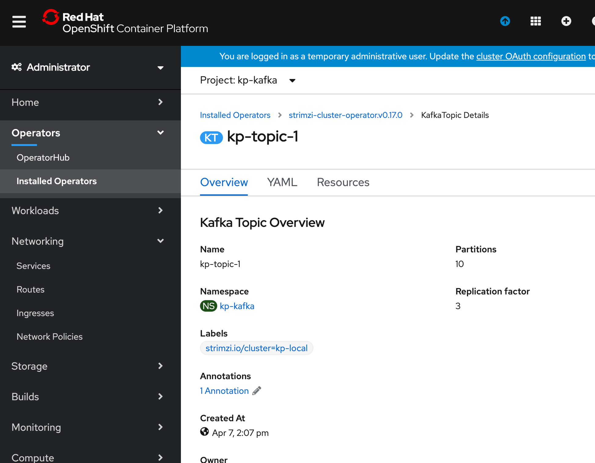
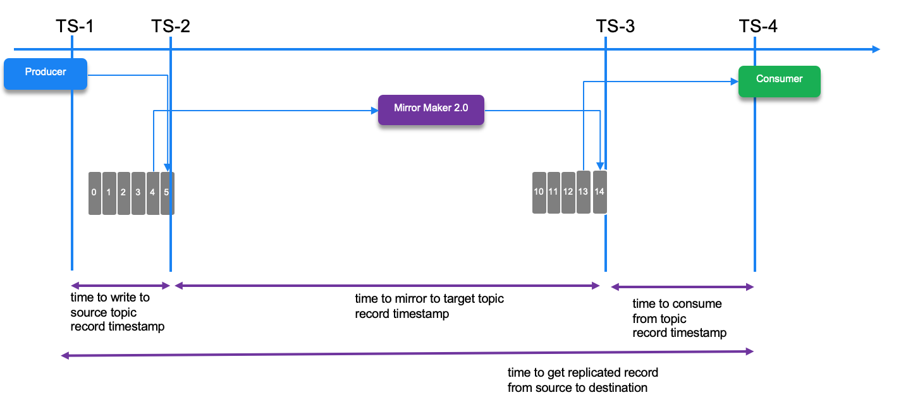

# Validation and Performance tests

The mirroring validation and performance tests are based on the architecture depicted in the following figure, where mirror maker 2 is running close to the on-premise target cluster and the source is Event Streams on Cloud.


## Validate the topic replication

### Objective

Determine if MirrorMaker 2 can successfully replicate messages from a topic with n partitions on the source Kakfa cluster to a topic with n-m partitions on the target Kafka cluster.

### Given

If given Manager rights on Event Streams, where Event Streams is the target Kafka cluster, MirrorMaker 2 will either create the target topic with n partitions or increase the number of partitions on the topic to n.  Both of these default behaviours are proven.

### Method 1

Create new Credential on IES on Cloud with Write permission, but not Manager permissions.  Reconfigure MirrorMaker 2 with the new Credential.  Create a new topic on IES on Cloud with 5 partitions that corresponds to a new topic on local Kafka with 10 partitions.  Test replication from the local Kafka topic to the topic on IES on IBM Cloud.  Observe any errors in MirrorMaker 2 log, and validate data replicates as expected.

#### Hypothesis

Data will replicate successfully.  

The MirrorMaker 2 architecture uses Kafka Connect, and so simply acts as a 3rd party consumer of topic data on the source side and writes to the topic on the target side as any other producer would.  Given sufficient partitions on each of the source and target topics for MirrorMaker 2 to act as a consumer (on the source side) and a producer (on the target side), how many total partitions each side has should not be a factor.

### Method 2 

Create new Credential on IES on Cloud with Write permission, but not Manager permissions.  Reconfigure MirrorMaker 2 with the new Credential.  Create a new topic on IES on Cloud with 10 partitions that corresponds to a new topic on local Kafka with 5 partitions.  Test replication from the local Kafka topic to the topic on IES on IBM Cloud.  Observe any errors in MirrorMaker 2 log, and validate data replicates as expected.

#### Hypothesis

(Same as previous hypothesis)

Data will replicate successfully.  The MirrorMaker 2 architecture uses Kafka Connect, and so simply acts as a 3rd party consumer of topic data on the source side and writes to the topic on the target side as any other producer would.  Given sufficient partitions on each of the source and target topics for MirrorMaker 2 to act as a consumer (on the source side) and a producer (on the target side), how many total partitions each side has should not be a factor.

### Method 1 - Implementation

* Get API KEYS and BROKERS URL for Event Streams

    ```json
    {
    "api_key": "_V...d",
    "apikey": "_VX...d",
    "iam_apikey_description": "Auto-generated for key ab427...6140e186969",
    "iam_apikey_name": "kp-writer",
    "instance_id": "7.....",
    "kafka_admin_url": "https://2ym....krl.svc03.us-south.eventstreams.cloud.ibm.com",
    "kafka_brokers_sasl": [
        "broker-3-2ymhj.....kafka.svc03.us-south.eventstreams.cloud.ibm.com:9093",
        "broker-4-2ymhj....kafka.svc03.us-south.eventstreams.cloud.ibm.com:9093",
        "broker-1-2ymhjg....kafka.svc03.us-south.eventstreams.cloud.ibm.com:9093"
    ],
    "kafka_http_url": "https://2ym....krl.svc03.us-south.eventstreams.cloud.ibm.com",
    "password": "_...",
    "user": "token"
    }
    ```

* Create a topic with 10 partitions on source cluster (e.g. kp-topic-1)



It could be done using CLI like:

```shell
./kafka-topics.sh --bootstrap-server eda-demo-24-cluster-kafka-bootstrap:9092 --create --partitions=10 --topic kp-topic-1
```

* Create a topic with 5 partitions on target cluster (e.g. kp-local.kp-topic-1)


If you need to look at the topic information using the shell command use something like:

```shell
./kafka-topics.sh --bootstrap-server eda-demo-24-cluster-kafka-bootstrap:9092 --describe --topic source.accounts

Topic: source.accounts	PartitionCount: 5	ReplicationFactor: 3	Configs: message.format.version=2.4-IV1
    Topic: source.accounts	Partition: 0	Leader: 0	Replicas: 0,2,1	Isr: 0,2,1
    Topic: source.accounts	Partition: 1	Leader: 2	Replicas: 2,1,0	Isr: 2,1,0
    Topic: source.accounts	Partition: 2	Leader: 1	Replicas: 1,0,2	Isr: 1,0,2
    Topic: source.accounts	Partition: 3	Leader: 0	Replicas: 0,1,2	Isr: 0,1,2
    Topic: source.accounts	Partition: 4	Leader: 2	Replicas: 2,0,1	Isr: 2,0,1
```

* Create a mirror maker 2 configuration to replicate the topic
 
#### Test Approach

This test is in the `perf-tests/ValidateTopicReplication` folder, and aims to validate the 10 partition topic to 5 partition topic replication.


* Send 500 records to the source topic using the producer code: [ProducerPerformance.py](https://github.com/jbcodeforce/kp-data-replication/blob/master/perf-tests/ProducerPerformance.py)
* Start the consumer on target topic in a unique consumer group so it gets the messages from all the 5 partitions, compare the number of message received: it should be 500.

The procedure is:

1. export the environment variable to access target cluster:

    ```shell
    export KAFKA_BROKERS=broker-3-h6s2xk6b2t77g4p1.kafka.svc01.us-east.eventstreams.cloud.ibm.com:9093,broker-1-h6s2xk6b2t77g4p1.kafka.svc01.us-east.eventstreams.cloud.ibm.com:9093,broker-0-h6s2xk6b2t77g4p1.kafka.svc01.us-east.eventstreams.cloud.ibm.com:9093,broker-5-h6s2xk6b2t77g4p1.kafka.svc01.us-east.eventstreams.cloud.ibm.com:9093,broker-2-h6s2xk6b2t77g4p1.kafka.svc01.us-east.eventstreams.cloud.ibm.com:9093,broker-4-h6s2xk6b2t77g4p1.kafka.svc01.us-east.eventstreams.cloud.ibm.com:9093
    export KAFKA_APIKEY="event stream apikey"
    ```

    Export the environment variables to point to the source cluster:

    ```shell
    export KAFKA_SRC_CERT=/home/ca.crt
    export KAFKA_SRC_BROKERS=eda-demo-24-cluster-kafka-bootstrap-eda-strimzi-kafka24.gse-eda-demo-43-fa9ee67c9ab6a7791435450358e564cc-0000.us-east.containers.appdomain.cloud
    ```


1. Start consumer: 

    Start the consumer to run locally but remote connected to the kafka cluster:

    ```shell
    docker run -ti -v $(pwd):/home -e KAFKA_BROKERS=$KAFKA_TGT_BROKERS -e KAFKA_CERT=$KAFKA_TGT_CERT ibmcase/python37  bash -c "python /home/PerfConsumer.py --topic source.accounts"
    ```

    Or run the consumer inside openshift

    ```
    oc run kafka-consumer -ti --image=strimzi/kafka:latest-kafka-2.4.0 --rm=true --restart=Never -- bin/kafka-console-consumer.sh --bootstrap-server $KAFKA_TGT_BROKERS --topic source.accounts -from-beginning
    ```

1. Start producer

    ```shell
    docker run -ti -v $(pwd):/home  -e KAFKA_BROKERS=$KAFKA_SRC_BROKERS ibmcase/python37 bash -c "python ProducerPerformance.py --file /home/ValidateTopicReplication/testplayload.json --size 500 --keyname identifier --topic accounts"
    ```

The number of records on the consumer side should match the number send (e.g. 500), but this time read from 5 partitions.

#### Conclusion Method 1

Hypothesis proven - MirrorMaker 2 can replicate from a local topic with 10 partitions to a remote topic with 5 partitions.

## Performance tests

For the performance test producer code, we use the IBM Event Stream tool which is itself based on the Apache [Kafka producer performance tool](https://github.com/apache/kafka/blob/trunk/tools/src/main/java/org/apache/kafka/tools/ProducerPerformance.java). This tool can read data from a file and generates n records to the source topic. [This article](https://ibm.github.io/event-streams/getting-started/testing-loads/) explains how to use the tool. We have cloned this tool under the [perf-test/event-streams-sample-producer](https://github.com/jbcodeforce/kp-data-replication/tree/master/perf-tests/event-streams-sample-producer-1.1.0) folder.

The tool reports test metrics like records per second, number of records sent, the megabytes per second, the average and maximum latencies,  from the producer.metrics() and other stats from the tools.

The arguments supported are:

| Argument | Description|
| --- | --- |
| --record-size `value`> or --payload-file `filename` | one is mandatory but not both. Work only for UTF-8 encoded text files|
| --topic `name` | mandatory |
| --num-records `value` | mandatory |
| --payload-delimiter `char` | delimiter to be used when --payload-file is provided. Default is \n |
| --throughput `value` | Throttle to value messages/sec. -1 to disable throtlling|
| --producer.config `filename` | producer config properties file|
| --producer-props `prop_name=value` | producer configuration properties|
| --print-metrics `true|false`| Default to true|
| --transactional-id `value` | Test with transaction |
| --transaction-duration-ms `value`| The max age of each transaction. Test with transaction if v>0 |

To completement this tool, we need a consumer that will be responsible to measure some of the latency between given timestamps. The following diagram presents the interesting time stamps we can assess with some tooling:




* ts-1: timestamp when creating the record object before sending
* ts-2: record timestamp when broker write to topic-partition: source topic
* ts-3: record timestamp when broker write to topic-partition: target topic
* ts-4: timestamp when polling the record

The consumer needs to be deployable on OpenShift to scale horizontally. The metrics can be exposed as metrics for Prometheus. The metrics are: average latency, min and max latencies.

The performance test consumer webapp is under the [perf-tests/perf-consumer-app folder](https://github.com/jbcodeforce/kp-data-replication/tree/master/perf-tests/perf-consumer-app). The readme explains how to build and deploy it.

### Test approach

Using IBM event streams producer tool we can run 3 different workload size, the payload is generated with random bytes or with records read from a data file.

```shell
java -jar target/es-producer.jar -t test -s small
java -jar target/es-producer.jar -t test -s medium
java -jar target/es-producer.jar -t test -s large
```

To build the jar,run `mvn package` in the [event-streams-sample-producer-1.1.0](https://github.com/jbcodeforce/kp-data-replication/tree/master/perf-tests/event-streams-sample-producer-1.1.0) folder.

Here is an example of call to this performance producer

```shell
 java -jar event-streams-sample-producer-1.1.0/target/es-producer.jar --payload-file ./da/records.json -t topic --producer-config ../mirror-maker-2/eventstream.properties
```

The `eventstream.properties` file define the bootstrap.servers, sasl configuration using Event Streams credentials and URLs. Something like:

```properties
bootstrap.servers=broker-3-.....eventstreams.cloud.ibm.com:9093
security.protocol=SASL_SSL
ssl.protocol=TLSv1.2
sasl.mechanism=PLAIN
sasl.jaas.config=org.apache.kafka.common.security.plain.PlainLoginModule required username="token" password="<replace with APIKAY>";
```

## Basic Measurement

This is the type of traces reported.

```shell
1261 records sent, 251.8 records/sec (0.97 MB/sec), 2233.3 ms avg latency, 3320.0 max latency.
2848 records sent, 569.5 records/sec (2.19 MB/sec), 5797.0 ms avg latency, 8294.0 max latency.
2840 records sent, 567.8 records/sec (2.19 MB/sec), 10760.9 ms avg latency, 13288.0 max latency.

..

60000 records sent, 490.869821 records/sec (1.89 MB/sec), 14698.93 ms avg latency, 24949.00 ms max latency, 14490 ms 50th, 22298 ms 95th, 23413 ms 99th, 24805 ms 99.9th.
```

Adding a consumer is simple, start a python environment using docker image, and launch the PerfConsumer code.

```shell
source ./scripts/setenv.sh
docker run -e KAFKA_BROKERS=$KAFKA_BROKERS --rm -v $(pwd):/home -it  ibmcase/python37 bash
$ python consumer/PerfConsumer.py
```

## Measuring with consumer app


