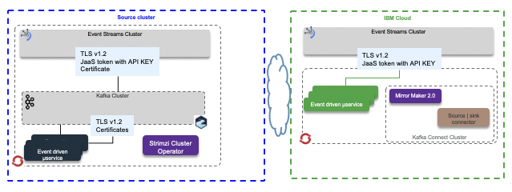
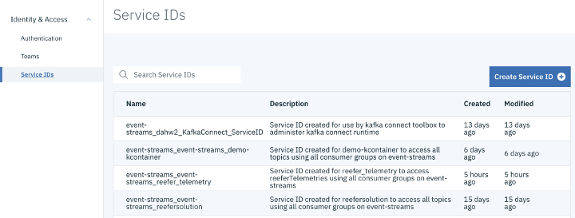
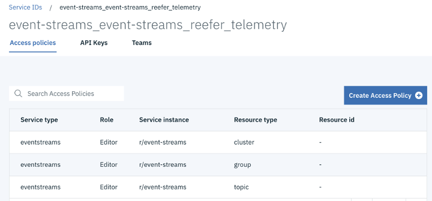
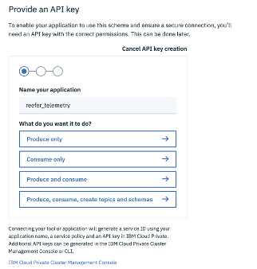
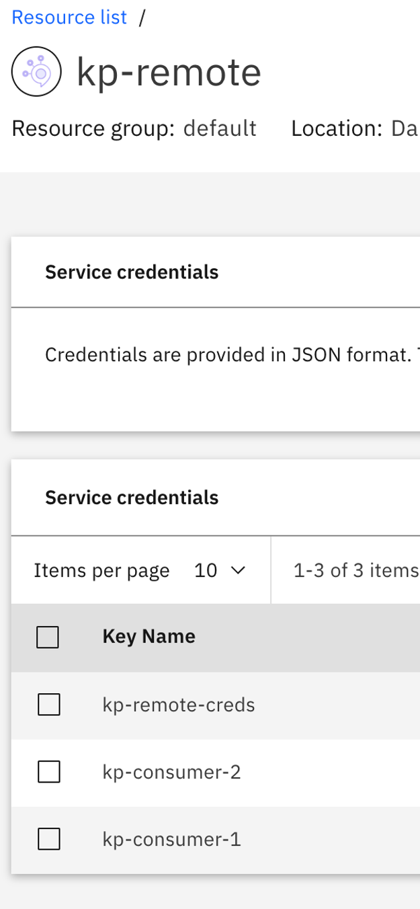

# Security considerations

## Concepts

The following diagram illustrates the security context in term of encryption and authentication between the different cluster types. Event Streams on premise, as part of Cloud Pak for integration, supports TLSv1.2 and CA certificates.



For Event Streams on Cloud as managed service, or on premise,  the authentication and authorization are done using [Java Authentication and Authorization Service](https://docs.oracle.com/javase/7/docs/technotes/guides/security/jaas/JAASRefGuide.html) using generic user name: `token` and APIKEY as password as part of the Jaas configuration. Here is an example of properties setting.

```properties
sasl.jaas.config=org.apache.kafka.common.security.plain.PlainLoginModule required username="token" password="<event-streams-apikey>";
```

When deployed in kubernetes those properties can be set in secret as config map and injected inside the consumer or producer pods. For mirror maker 2, the CRD definition supports the authentication stanza that can use secret, which will be used by the MM2 java code to define a JaaS configuration.

```
    authentication:
      passwordSecret:
          secretName: es-api-secret  
          password: password 
      username: token
      type: plain
```

For other app connecting to event streams, the code need to set other SaaS parameters to encrypt via TLS and authenticate via SASL (the security protocol is SASL_SSL):

```java
properties.put(CommonClientConfigs.SECURITY_PROTOCOL_CONFIG, "SASL_SSL");
properties.put(SaslConfigs.SASL_MECHANISM, "PLAIN");
properties.put(SaslConfigs.SASL_JAAS_CONFIG,
"org.apache.kafka.common.security.plain.PlainLoginModule required username=\"token\" password=\""
+ env.get("KAFKA_APIKEY") + "\";");
```

### Encryption

The Clients to Broker communications are encrypted. Event Streams clients need to define the protocol using properties like:

```java
properties.put(SslConfigs.SSL_PROTOCOL_CONFIG, "TLSv1.2");
properties.put(SslConfigs.SSL_ENABLED_PROTOCOLS_CONFIG, "TLSv1.2");
```

With Java code, the CA root and client certiticates needs to be in the Truststore.jks file. Host name verification is enabled by default to avoid man in the middle attacks. The clients code will verify the server’s fully qualified domain name (FQDN) against Common Name or Subject Alternative Name.

## Event streams security considerations

The [product documentation](https://cloud.ibm.com/docs/services/EventStreams?topic=eventstreams-security) explains how to control access to Kafka / Event Streams resources like cluster, topic, consumer group and control transaction support.

The access is controled via roles: reader, writer, manager. Access is done via Identity and access management service, where policies are defined for each potential resources. User and serviceId can be used and assigned to role.



Each service policy defines the level of access that the service ID has to each resource or set of resources. A policy consists of the following information:

* The role assigned to the policy. For example, Viewer, Editor, or Operator.
* The type of service the policy applies to. For example, IBM Event Streams.
* The instance of the service to be secured.
* The type of resource to be secured. The valid values are cluster, topic, group, or txnid. Specifying a type is optional. If you do not specify a type, the policy then applies to all resources in the service instance.
* The identifier of the resource to be secured. Specify for resources of type topic, group and txnid. If you do not specify the resource, the policy then applies to all resources of the type specified in the service instance.



For each topic it is possible to control the access type, and get a specific API key for accessing one or all the topics.



## ACL replications

The following scenario validates the Mirror Maker 2 ACL replication. The goal is to define the same users between Event Streams on the cloud and local kafka may be deployed and operated with Strimzi. Two users are created (kp-consumer-1,kp-consumer-2) to access two different topics (kp-topic-1, kp-topic-2) respectively.

* Create new user, named `kp-consumer-1` on local Kafka environment, using for example a Strimzi Kafka User, or using any mechanism to add user to k8s cluster. The following descriptor defines the ACL at a given topic: `kp-topic-1`

```yaml
apiVersion: kafka.strimzi.io/v1beta1
kind: KafkaUser
metadata:
  name: kp-consumer-1
  labels:
    strimzi.io/cluster: kp-local
  namespace: kp-kafka
spec:
  authentication:
    type: tls
  authorization:
    type: simple
    acls:
      - resource:
          type: topic
          name: kp-topic-1
          patternType: literal
        operation: Read
        host: '*'
      - resource:
          type: topic
          name: kp-topic-1
          patternType: literal
        operation: Describe
        host: '*'
      - resource:
          type: group
          name: kp-users
          patternType: literal
        operation: Read
        host: '*'
      - resource:
          type: topic
          name: kp-topic-1
          patternType: literal
        operation: Write
        host: '*'

```

* Do the same for a second user `kp-consumer-2` accessing another topic `kp-topic-2:

```yaml
apiVersion: kafka.strimzi.io/v1beta1
kind: KafkaUser
metadata:
  name: kp-consumer-2
  labels:
    strimzi.io/cluster: kp-local
  namespace: kp-kafka
spec:
  authentication:
    type: tls
  authorization:
    type: simple
    acls:
      - resource:
          type: topic
          name: kp-topic-2
          patternType: literal
        operation: Read
        host: '*'
      - resource:
          type: topic
          name: kp-topic-2
          patternType: literal
        operation: Describe
        host: '*'
      - resource:
          type: group
          name: kp-users
          patternType: literal
        operation: Read
        host: '*'
      - resource:
          type: topic
          name: kp-topic-2
          patternType: literal
        operation: Write
        host: '*'

```

* On the IBM Event Streams side, define credentials for the different potential access roles: reader, writer or manager. 



Those credentials are automatically visible as `Service IDs` inside IBM Access Manager.


* Using IBM IAM and the service ID, define the access control for each of the service ID. The following figure  


* In the mirror maker 2 configuration you can enable/disable the ACLs synch flag using the property:

```properties
sync.topic.acls.enabled=true
```

If it was set to false (default), we can assess the access per topic using the kafka ACL tool. User `kp-consumer-1` has access to source topic `kp-topic-1` and the remote topic on target cluster has no ACL moved.

```shell
sh-4.2$ bin/kafka-acls.sh --authorizer kafka.security.auth.SimpleAclAuthorizer --authorizer-properties zookeeper.connect=localhost:2181 --list --topic kp-topic-1
Current ACLs for resource `Topic:LITERAL:kp-topic-1`: 
        User:CN=kp-consumer-1 has Allow permission for operations: Write from hosts: *
        User:CN=kp-consumer-1 has Allow permission for operations: Describe from hosts: *
        User:CN=kp-consumer-1 has Allow permission for operations: Read from hosts: * 

sh-4.2$ bin/kafka-acls.sh --authorizer kafka.security.auth.SimpleAclAuthorizer --authorizer-properties zookeeper.connect=localhost:2181 --list --topic kp-remote.kp-topic-1

```
